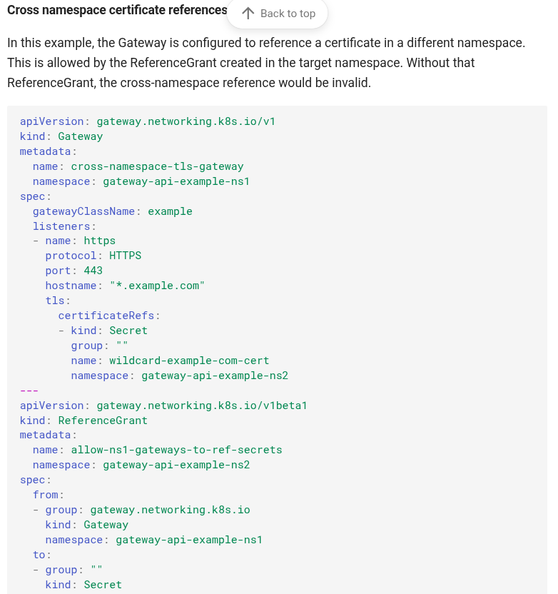

# Reuseable Repository for ***GatewayApi*** into **Staging** and **Development** Environment

## This workflow is reference from **airborneo-cms** repo.

### There are 16 steps

1. Checkout code

2. Install OCI CLI

3. Set up kubectl

4. Set up Kustomize

5. Configure Oracle Cloud and Kubernetes access

6. Verify cluster connection

7. Verify cluster connection

8. Setup Helm

9. Check if Gateway API already exists

10. Install Gateway API CRDs

11. Install NGINX Gateway Fabric Gateway Class

12. Ensure Gateway in nginx-gateway namespace or not

13. Validate Kubernetes manifests

14. Deploy to Kubernetes

15. Get Gateway-Api status

16. Clean up SSH tunnel

## Workflow file

- `.github/workflows/install-gateway.yaml`

## What actions in this workflow

1. Check **gatewayclass** and **gateway** in *nginx-gateway* namespace.

2. If these are already installed, skip these steps and go to step **4**.

3. If there are not installed yet, will install the following steps.
   1. Gateway API CRDs
   2. Gateway Class

4. Install **gateway** in *nginx-gateway* namespace.

5. Once you successfully install **gateway**, **LoadBalancer** will be automatically created in OCI.

**NOTED**:  **Loadbalancer** subnet must be **public subnet** in yor OCI.


    
## What in this Repository

- We will use **Kustomization** method to patch depend on what we require for   two environments **Development** and **Staging**.

- Install Nginx Gateway Fabric
  - Reference: [Nginx Gateway Fabric][gatewayclass]

[gatewayclass]: https://docs.nginx.com/nginx-gateway-fabric/install/helm/

- Install Gateway-api
  - Reference: [Gateway-Api]

[Gateway-Api]: https://gateway-api.sigs.k8s.io/


## Directory Structure
```
├── ci
│   ├── base
│   │   ├── gateway.yaml
│   │   ├── kustomization.yaml
│   │   ├── namespace.yaml
│   │   ├── referencegrant-cms.yaml
│   │   └── referencegrant-web.yaml
│   └── environments
│       ├── development
│       │   ├── gateway-patch.yaml
│       │   ├── kustomization.yaml
│       │   ├── referencegrant-cms-patch.yaml
│       │   └── referencegrant-web-patch.yaml
│       └── staging
│           ├── gateway-patch.yaml
│           ├── kustomization.yaml
│           ├── referencegrant-cms-patch.yaml
│           └── referencegrant-web-patch.yaml
├── README.md
└── referencegrant.png
```
## What is in ***base*** directory

1. **namespace.yaml** 
   - create **nginx-gateway** namespace.

2. **gateway.yaml** 
   -  create *abdigital-gateway* under *nginx-gateway* namespace and    include *listeners* for different services.

3. **referencegrant-cms.yaml**
   - *abdigital-gateway* relys on this because **listeners** need to use secrets **airborneo-cms-tls** under **airborneo-cms-uat** namespace.

4. **referencegrant-web.yaml**
   - *abdigital-gateway* relys on this because **listeners** need to use secrets **airborneo-web-tls** under **airborneo-web-uat** namespace.

  

5. **kustomization.yaml**
   - easy to customize manifest files under **base** directory.


# There are two environments 

## Staging

- need to change depend on staging environment to overwrite default values under **base** directory.

- make sure **hostname** in **gateway-patch.yaml**

- make sure **namespace** where locate secret in **referencegrant-cms-patch.yaml**

- make sure **namespace** where locate secret in **referencegrant-web-patch.yaml**

## Development

- need to change depend on development environment to overwrite default values under **base** directory.

- make sure **hostname** in **gateway-patch.yaml**

- make sure **namespace** where locate secret in **referencegrant-cms-patch.yaml**

- make sure **namespace** where locate secret in **referencegrant-web-patch.yaml**

